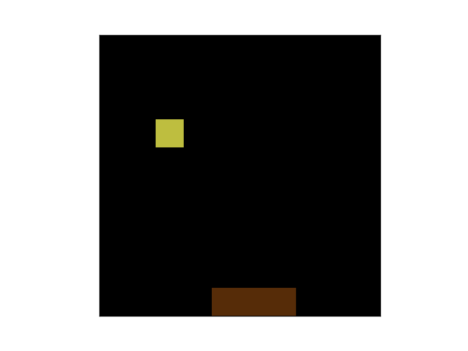

# QLearnCatch

This is a demonstration of Reinforcement Learning using the [OpenAI Gym](https://gym.openai.com/)
framework in combination with Theano / Lasagne.



We first create a [learning environment for the OpenAI Gym for the game Catch](OpenAI Gym Catch environment.ipynb).

Then we create an agent class, which implements a neural network to estimate
the Q-value function of actions.

## Requires

The following must be installed in order to run QLearnCatch:

 - matplotlib
 - numpy
 - Theano
 - Lasagne
 - OpenAI Gym

## How to run

To train an agent to play Catch and then play 10 games, run:

```
python qlearn_catch.py
```

You can modify the script `qlearn_catch.py` to save the trained network to a file,
or to load a previously saved network instead of training a new network from scratch.

## Known issues

It seems that occasionally the algorithm might not converge to a winning
strategy. I've noticed in such cases that after about 150 episodes, the loss
function consistently returns values of the form 0.##00, 0.##33, 0.##67, but
without converging to 0. Starting the script again with the command above then
often does converge. At present I am still investigating the cause of this
problem - if you have any suggestions, please let me know!

## Contributors

- Erik Jan de Vries: https://twitter.com/erikjandevries
